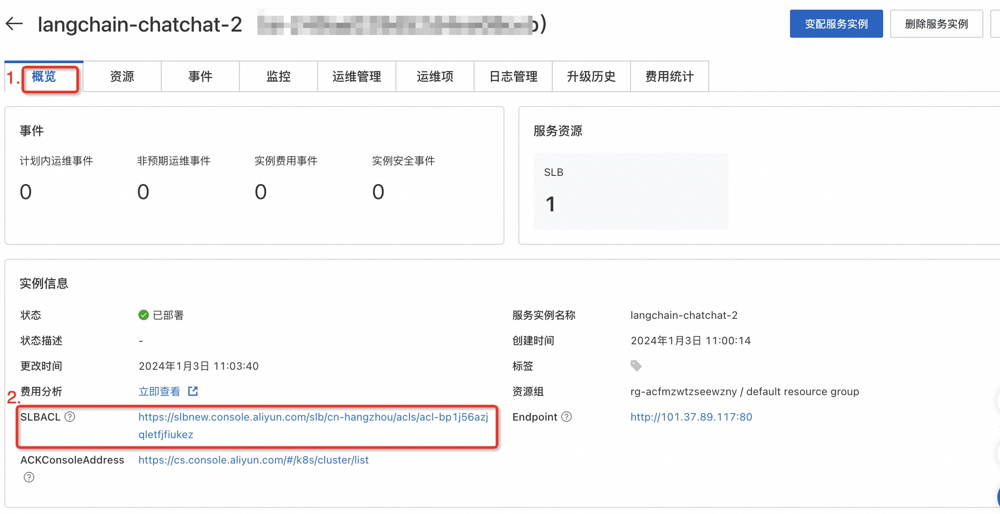

# Langchain-chatchat服务部署文档

## 概述

Langchain-chatchat服务基于开源本地知识库问答项目[Langchain-Chatchat](https://github.com/chatchat-space/Langchain-Chatchat),
集成了阿里云推理引擎DeepGPU-LLM，AnalyticDB for PostgreSQL向量数仓等产品，快速构建检索增强生成(RAG)大模型知识库项目。
本文向您介绍如何开通计算巢上的`Demo`服务，以及部署流程和使用说明。

## 注意事项

<font color="red">
阿里云不对第三方模型的合法性、安全性、准确性进行任何保证，阿里云不对由此引发的任何损害承担责任。

您应自觉遵守第三方模型的用户协议、使用规范和相关法律法规，并就使用第三方模型的合法性、合规性自行承担相关责任。
</font></br>

## 部署架构

Langchain-chatchat由Nginx、Chat及LLM组成。

- Nginx：网关服务，负责将请求转发到Chat服务。
- Chat：ChatBot应用，支持LLM问答和知识库问答。Database用于存储知识库Embedding后的向量。Database支持`faiss`及`ADB`两种类型。
- LLM：模型推理服务，基于开源的FastChat项目部署LLM模型。默认使用DeepGPU-LLM加速推理的qwen-7b-chat-aiacc模型。支持替换为其他开源模型或DeepGPU-LLM加速模型，替换模型可通过pvc挂载到容器中。

## 应用配置

### 部署参数说明

| 参数           | 描述                                                                            | 默认值                |
|:-------------|:------------------------------------------------------------------------------|:-------------------|
| ACK集群ID      | ACK集群ID                                                                       | 无                  |
| 数据库类型        | 向量数据库类型。取值：faiss or adb。                                                      | faiss              |
| 应用登陆名        | Nginx登陆名称                                                                     | admin              |
| 应用登陆密码       | Nginx登陆密码                                                                     | 无                  |
| 应用白名单        | 可以访问应用的IP或者CIDR网段。                                                            | 127.0.0.1          |
| 模型名称         | llm模型名称                                                                       | qwen-7b-chat-aiacc |
| 是否使用量化(8bit) | llm模型int8量化                                                                   | true               |
| 模型PVC        | 模型存储PVC，挂载到容器内/llm-model目录                                                    | true               |
| 知识库PVC       | 已存在的PVC，用于保存本地知识库文件。如使用                                                       | 无                  |
| 实例类型         | 模型推理服务部署方式，取值：ecs or eci。ecs将应用部署到ECS节点上。eci将部署到ECI上（ACK Serverless集群请使用eci）。 | ecs                |

### 修改应用白名单
应用白名单默认值为127.0.0.1，您可以通过以下方式修改。
#### 新建服务
创建服务时可以指定应用白名单参数，建议添加本机公网出口地址（可通过浏览器访问ifconfig.me、myip.ipip.net获取），否则本机将无法访问服务。

#### 已有服务
如果服务已经创建，可以在服务概览页面 > 实例信息点击SLBACL链接进行修改。SLBACL配置可参考[访问控制](https://help.aliyun.com/zh/slb/classic-load-balancer/user-guide/overview-3)。

### 向量数据库

#### faiss

faiss是由facebook开源的一款内存向量库，项目地址[https://github.com/facebookresearch/faiss](https://github.com/facebookresearch/faiss)。  
faiss内存数据库部署在chat pod中，受chat pod的资源约束。如果使用faiss向量数据库，建议增加chat pod的内存资源。

#### AnalyticDB PostgreSQL (简称 ADB)

云原生数据仓库AnalyticDB
PostgreSQL版是一种大规模并行处理（MPP）数据仓库服务，可提供海量数据在线分析服务。产品简介请参考文档[什么是云原生数据仓库](https://help.aliyun.com/zh/analyticdb-for-postgresql/product-overview/overview-product-overview)。  
Langchain-chatchat项目中使用的ADB需要满足以下条件：

- 需开启向量引擎优化功能
- 计算节点规格>=4C16G

### embedding模型

应用内置的embedding模型为text2vec-bge-large-chinese，详情请参考[hugging face文档](https://huggingface.co/shibing624/text2vec-bge-large-chinese)。

chat应用默认使用CPU运行embedding模型，可通过在`chat.pod.resources`中申请GPU资源来提高文本向量化速度。

## 模型配置

### 支持的模型列表

| 模型类型            | 模型名称                     | 容器内模型文件路径                           |
|:----------------|:-------------------------|:------------------------------------|
| DeepGPU-LLM转换模型 | qwen-7b-chat-aiacc       | /llm-model/qwen-7b-chat-aiacc       |
| DeepGPU-LLM转换模型 | qwen-14b-chat-aiacc      | /llm-model/qwen-14b-chat-aiacc      |
| DeepGPU-LLM转换模型 | chatglm2-6b-aiacc        | /llm-model/chatglm2-6b-aiacc        |
| DeepGPU-LLM转换模型 | baichuan2-7b-chat-aiacc  | /llm-model/baichuan2-7b-chat-aiacc  |
| DeepGPU-LLM转换模型 | baichuan2-13b-chat-aiacc | /llm-model/baichuan2-13b-chat-aiacc |
| DeepGPU-LLM转换模型 | llama-2-7b-hf-aiacc      | /llm-model/llama-2-7b-hf-aiacc      |
| DeepGPU-LLM转换模型 | llama-2-13b-hf-aiacc     | /llm-model/llama-2-13b-hf-aiacc     |
| 开源模型            | qwen-7b-chat             | /llm-model/Qwen-7B-Chat             |
| 开源模型            | qwen-14b-chat            | /llm-model/Qwen-14B-Chat            |
| 开源模型            | chatglm2-6b              | /llm-model/chatglm2-6b              |
| 开源模型            | chatglm2-6b-32k          | /llm-model/chatglm2-6b-32k          |
| 开源模型            | baichuan2-7b-chat        | /llm-model/Baichuan2-7B-Chat        |
| 开源模型            | baichuan2-13b-chat       | /llm-model/Baichuan2-13B-Chat       |
| 开源模型            | llama-2-7b-hf            | /llm-model/Llama-2-7b-hf            |
| 开源模型            | llama-2-13b-hf           | /llm-model/Llama-2-13b-hf           |

### 使用DeepGPU-LLM转换模型

[DeepGPU-LLM](https://help.aliyun.com/zh/egs/what-is-deepgpu-llm)是阿里云研发的基于GPU云服务器的大语言模型（Large
Language
Model，LLM）推理引擎，旨在优化大语言模型在GPU云服务器上的推理过程，通过优化和并行计算等技术手段，提供免费的高性能、低延迟推理服务。DeepGPU-LLM使用方式请参考文档[使用DeepGPU-LLM实现大语言模型在GPU上的推理优化](https://help.aliyun.com/zh/egs/developer-reference/install-and-use-deepgpu-llm)。

Langchain-chatchat项目已安装DeepGPU-LLM，默认使用DeepGPU-LLM加速后的模型qwen-7b-chat-aiacc。

如想要使用DeepGPU-LLM对其他开源LLM模型进行推理优化，您需要先将huggingface格式的开源模型转换为DeepGPU-LLM支持的格式，然后才能使用DeepGPU_LLM进行模型的推理优化服务。以qwen-7b-chat为例，可使用如下命令在容器中进行模型格式转换：

```text
#qwen-7b weight convert
huggingface_qwen_convert \
    -in_file /llm-model/Qwen-7B-Chat \
    -saved_dir /llm-model/qwen-7b-chat-aiacc \
    -infer_gpu_num 1 \
    -weight_data_type fp16 \
    -model_name qwen-7b
```

### 更换模型

#### 步骤一：创建静态PV及PVC

- OSS模型

1. 执行以下命令创建Secret。

```bash
kubectl create -f oss-secret.yaml
```

以下为创建Secret的oss-secret.yaml示例文件，需要指定akId和akSecret。

```yaml
apiVersion: v1
kind: Secret
metadata:
  name: oss-secret
  namespace: default
stringData:
  akId: <your AccessKeyID>
  akSecret: <your AccessKeySecret>
```

2. 执行以下命令创建静态卷PV。

```bash
  kubectl create -f model-oss.yaml
```

以下为创建静态卷PV的model-oss.yaml示例文件，需要指定bucket,url等参数。

```yaml
apiVersion: v1
kind: PersistentVolume
metadata:
  name: model-oss
  labels:
    alicloud-pvname: model-oss
spec:
  capacity:
    storage: 30Gi
  accessModes:
    - ReadOnlyMany
  persistentVolumeReclaimPolicy: Retain
  csi:
    driver: ossplugin.csi.alibabacloud.com
    volumeHandle: model-oss
    nodePublishSecretRef:
      name: oss-secret
      namespace: default
    volumeAttributes:
      bucket: "<your bucket name>"
      url: "<your oss endpoint>" # oss-cn-hangzhou.aliyuncs.com
      otherOpts: "-o umask=022 -o max_stat_cache_size=0 -o allow_other"
      path: "/"
```

3. 执行以下命令创建静态卷PVC。

```bash
kubectl create -f pvc-oss.yaml
```

以下为创建静态卷PVC的model-pvc.yaml示例文件。

```yaml
apiVersion: v1
kind: PersistentVolumeClaim
metadata:
  name: model-pvc
spec:
  accessModes:
    - ReadOnlyMany
  resources:
    requests:
      storage: 30Gi
  selector:
    matchLabels:
      alicloud-pvname: model-oss
```

参数配置可参考[使用OSS静态存储卷](https://help.aliyun.com/zh/ack/ack-managed-and-ack-dedicated/user-guide/mount-statically-provisioned-oss-volumes)。

- NAS模型

1. 执行以下命令创建静态卷PV。

```bash
kubectl create -f model-nas.yaml
```

以下为创建静态卷PV的model-nas.yaml示例文件，需要指定NAS服务地址和路径。

```yaml
apiVersion: v1
kind: PersistentVolume
metadata:
  name: model-nas
  labels:
    alicloud-pvname: model-nas
spec:
  capacity:
    storage: 30Gi
  accessModes:
    - ReadWriteMany
  csi:
    driver: nasplugin.csi.alibabacloud.com
    volumeHandle: model-nas
    volumeAttributes:
      server: "<your nas server>"
      path: "<your model path>"
  mountOptions:
    - nolock,tcp,noresvport
    - vers=3
```

2. 执行以下命令创建静态卷PVC。

```bash
kubectl create -f model-pvc.yaml
```

以下为创建静态卷PVC的model-pvc.yaml示例文件。

```yaml
kind: PersistentVolumeClaim
apiVersion: v1
metadata:
  name: model-pvc
spec:
  accessModes:
    - ReadWriteMany
  resources:
    requests:
      storage: 30Gi
  selector:
    matchLabels:
      alicloud-pvname: model-nas
```

参数配置可参考[使用NAS静态存储卷](https://help.aliyun.com/zh/ack/ack-managed-and-ack-dedicated/user-guide/mount-statically-provisioned-nas-volumes)。

#### 步骤二：更新Helm Value

1. 控制台点击变配服务实例。
2. 选择Chart Values变更
3. 填写`Model`为新的模型名称，`模型PVC`为存储新模型的pvc名称。模型名称及模型挂载路径参考支持的模型列表。

## Release Note

| 版本号     | 变更时间         | 变更内容                                               |
|---------|--------------|----------------------------------------------------|
| `0.1.0` | 2023年12月26日	 | 支持阿里云推理引擎DeepGPU-LLM，AnalyticDB for PostgreSQL向量数仓 |

